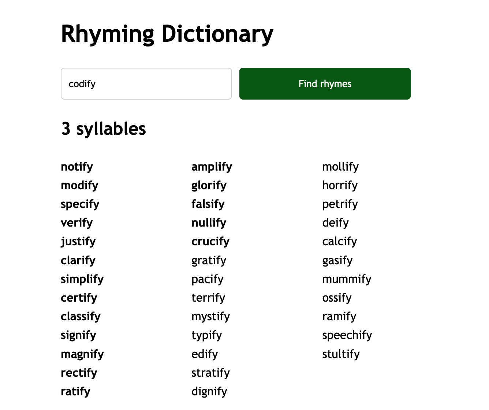

# Rhyming Dictionary

A minimal rhyming dictionary.

## License

This project is licensed under an [MIT license](LICENSE).

The dictionary used for rhyming, `cmudict`, is licensed as All rights reserved by Carnegie Mellon University. The dictionary is included in this repository for convenience, but it is not part of the MIT license.
